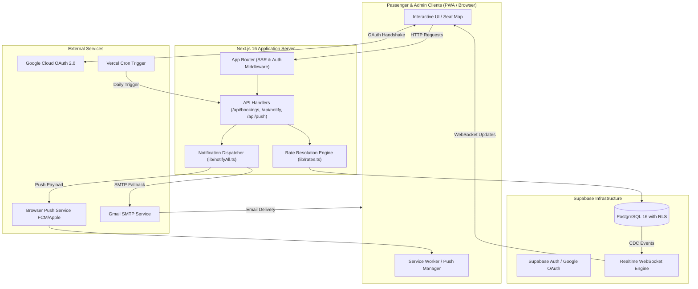
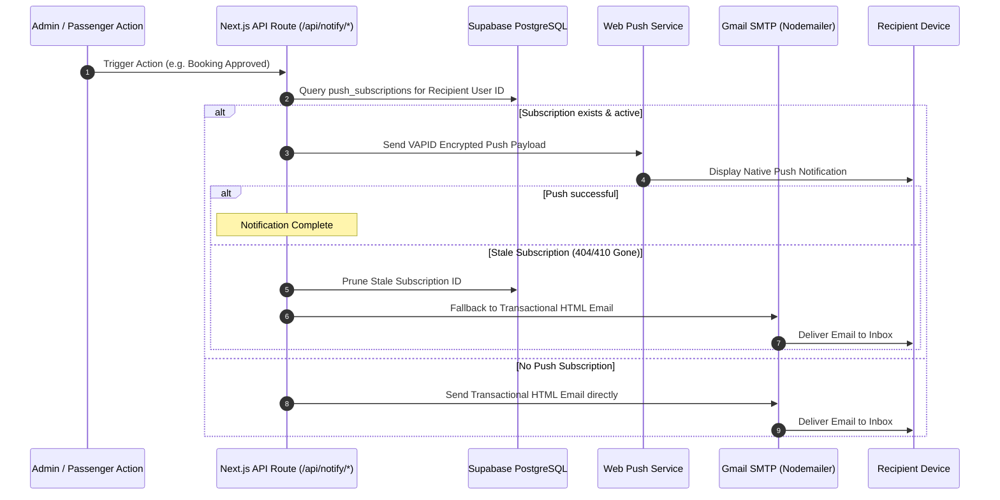
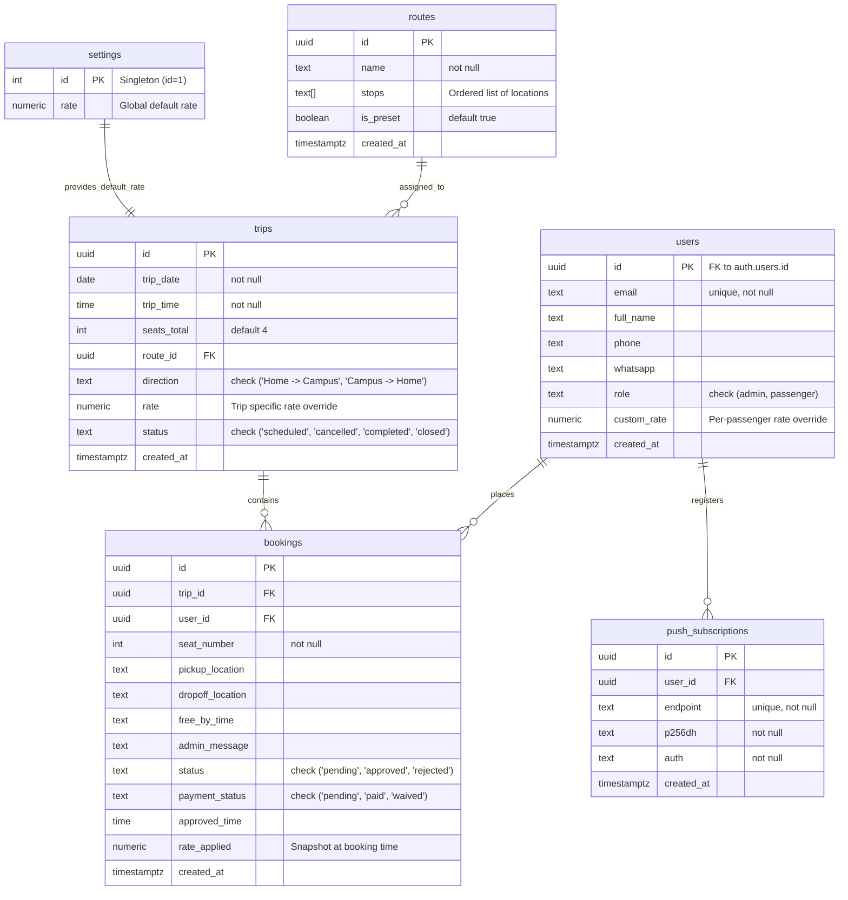

# 🚗 Carpool Hub (Ammar FAST Carpool)

[](https://nextjs.org/)
[](https://react.dev/)
[](https://www.typescriptlang.org/)
[](https://tailwindcss.com/)
[](https://supabase.com/)
[](https://web.dev/progressive-web-apps/)
[](#license)

**Carpool Hub** is a real-time, closed-group carpooling and fleet coordination Progressive Web Application (PWA) built specifically for a dedicated university commute group (1 driver/admin and 10–15 regular passengers) traveling to and from **FAST NUCES**. 

It replaces chaotic, high-friction WhatsApp message threads with a centralized telemetry dashboard featuring an interactive real-time car seat visual, bidirectional trip booking workflows, passenger custom rate management, payment tracking, and a dual-channel (Web Push + SMTP Email) notification pipeline.

---

## 📑 Table of Contents

- [Key Features](#-key-features)
- [Tech Stack](#-tech-stack)
- [System Architecture](#-system-architecture)
  - [High-Level Data Flow](#high-level-data-flow)
  - [Directory Structure](#directory-structure)
  - [Notification Fallback Flow](#notification-fallback-flow)
- [Prerequisites](#-prerequisites)
- [Getting Started](#-getting-started)
  - [1. Clone and Install Dependencies](#1-clone-and-install-dependencies)
  - [2. Environment Configuration](#2-environment-configuration)
  - [3. Database Setup & Migrations](#3-database-setup--migrations)
  - [4. Generating VAPID Keys & Notification Badge](#4-generating-vapid-keys--notification-badge)
  - [5. Run Development Server](#5-run-development-server)
- [Environment Variables](#-environment-variables)
- [Database Schema & Row Level Security](#-database-schema--row-level-security)
- [API Route Reference](#-api-route-reference)
- [Available Scripts](#-available-scripts)
- [Design System & Philosophy](#-design-system--philosophy)
- [Production Deployment](#-production-deployment)
- [Troubleshooting & FAQ](#-troubleshooting--faq)
- [License](#-license)

---

## 🌟 Key Features

### 💺 Interactive Real-Time Car Seat Telemetry
- **SVG Vector Seat Map**: Custom-traced vehicle chassis matching the physical car seating layout (Driver, Front Passenger, Back Left, Back Center, Back Right).
- **Sub-Second Live Synchronization**: Powered by Supabase Realtime WebSocket publications (`bookings`, `trips`, `users`), reflecting state changes across all connected devices instantly without page reloads.
- **Optimistic State Transitions**: Smooth color transitions representing seat status:
  - ⚪ `Available` — Open seat ready to be booked.
  - 🟡 `Pending` / `Mine Pending` — Requested by a passenger, awaiting driver approval.
  - 🟢 `Approved` — Confirmed passenger seat.

### 🛡️ University Domain Whitelist & Secure Auth
- **Domain Gatekeeping**: Google OAuth integration strictly bound to the institutional domain (e.g. `@nu.edu.pk`) verified server-side inside `/api/auth/callback`. Non-university Google accounts are rejected immediately.
- **Postgres Row Level Security (RLS)**: Fine-grained access control preventing non-admin passengers from tampering with trips, routes, rates, or escalating user roles.

### 🔄 Bidirectional Commute Lifecycle
- **Home ➔ Campus Commutes**: Passengers request seats and specify their exact custom pickup spot. Admin approves with scheduled pickup time.
- **Campus ➔ Home Commutes**: Passengers specify drop-off locations and "Free-by" class end times. Admin approves with custom departure notes.
- **One-Click Rebooking**: Passengers whose booking was previously rejected can edit details and re-request without starting over.

### 💰 Tiered Rate Engine & Payment Tracking
- **Rate Priority Hierarchy**: Resolves pricing dynamically:
  $$\text{Passenger Custom Rate} \succ \text{Trip Override Rate} \succ \text{Global Default Rate}$$
- **Historical Rate Freezing**: `rate_applied` is frozen into the booking record at creation time, preserving financial audit accuracy even if global or passenger rates are altered later.
- **Payment Reconciliation Ledger**: Admin dashboard tracks cumulative revenue, unpaid arrears, and individual passenger payment statuses (`pending`, `paid`, `waived`).

### 🔔 Smart Dual-Channel Notification Engine
- **Push-First with Email Fallback**: When an event occurs (New Booking, Approval, Rejection, Trip Announcement), the system checks if the recipient has an active Web Push subscription. If subscribed, it delivers an instant PWA push; otherwise, it automatically falls back to transactional email via Gmail SMTP (Nodemailer).
- **Vercel Daily Digest Cron**: Daily scheduled automated cron (`/api/cron/digest` at 19:00 UTC) notifying the admin of all outstanding pending requests before the next morning's commute.
- **Frictionless WhatsApp Link**: Quick-action modal with direct `wa.me` deep links to the admin's personal number for immediate ad-hoc communication.

### 📲 Progressive Web App (PWA)
- Full service worker caching (`sw.js`), web app manifest (`manifest.json`), custom iOS Safari / Android install prompt banner (`InstallPrompt.tsx`), and automated monochrome notification badge generation (`scripts/generate_badge.js`).

---

## 🛠️ Tech Stack

| Layer | Technology | Version | Purpose |
|---|---|---|---|
| **Framework** | [Next.js](https://nextjs.org/) | `16.3.0` | React App Router framework, SSR, and API route handlers |
| **UI Library** | [React](https://react.dev/) | `19.2.8` | Declarative component UI engine |
| **Language** | [TypeScript](https://www.typescriptlang.org/) | `5.x` | Strict end-to-end type safety |
| **Styling** | [Tailwind CSS](https://tailwindcss.com/) | `v4` | High-performance CSS design token system |
| **Animation** | [Framer Motion](https://www.framer.com/motion/) | `13.1.0` | Instrument-cluster transitions and modal animations |
| **Database & Auth** | [Supabase](https://supabase.com/) | `2.112.3` | PostgreSQL 16 database, Google OAuth, and Realtime engine |
| **Push Notifications** | [web-push](https://www.npmjs.com/package/web-push) | `3.6.7` | Web Push protocol server client with VAPID authentication |
| **Email Service** | [Nodemailer](https://nodemailer.com/) | `6.9.16` | Transactional email delivery via Gmail SMTP |
| **Image Processing** | [Sharp](https://sharp.pixelplumbing.com/) | `0.33.5` | Notification badge and PWA icon generation |
| **Deployment** | [Vercel](https://vercel.com/) | Edge Network | Serverless hosting with automated Cron jobs |

---

## 🏗️ System Architecture

### High-Level Data Flow



### Directory Structure

```
carpool/
├── public/                     # Static assets, PWA icons, and service worker
│   ├── badge.png               # Android notification status bar badge
│   ├── favicon.svg             # Vector application favicon
│   ├── icon-192.png            # PWA standard home screen icon
│   ├── icon-512.png            # PWA high-res icon
│   ├── icon-512-maskable.png   # PWA maskable adaptive icon
│   ├── manifest.json           # Progressive Web App manifest
│   └── sw.js                   # Service Worker for push notifications & caching
├── scripts/
│   └── generate_badge.js       # Script to generate Android status bar badge icon
├── src/
│   ├── app/                    # Next.js App Router root
│   │   ├── admin/              # Admin dashboard view & tabbed control center
│   │   │   ├── AdminClient.tsx # Interactive admin client state & actions
│   │   │   └── page.tsx        # Server-rendered admin route entry with role check
│   │   ├── api/                # API Route endpoints
│   │   │   ├── bookings/       # Booking creation & rebooking routes
│   │   │   ├── cron/digest/    # Daily digest scheduled cron handler
│   │   │   ├── notify/         # Multi-channel notification endpoints
│   │   │   └── push/subscribe/ # Web push subscription management
│   │   ├── auth/callback/      # OAuth exchange & domain validation handler
│   │   ├── dashboard/          # Passenger dashboard view & seat selection
│   │   │   ├── DashboardClient.tsx # Realtime seat map state & booking modal
│   │   │   └── page.tsx        # Server-rendered passenger dashboard entry
│   │   ├── login/              # Login screen with Google OAuth trigger
│   │   ├── globals.css         # Global Tailwind v4 theme & instrument styles
│   │   ├── InstallPrompt.tsx   # Custom iOS/Android PWA installation banner
│   │   ├── layout.tsx          # Root HTML layout with fonts & grain overlay
│   │   ├── page.tsx            # Root redirector (Auth dispatch)
│   │   ├── PushToggle.tsx      # Push notification subscription toggle button
│   │   └── RegisterSW.tsx      # Client component registering service worker
│   ├── components/             # Reusable UI component library
│   │   ├── AdminApprovalModal.tsx  # Modal for approving bookings & setting time
│   │   ├── BaseModal.tsx       # Accessible animated modal foundation
│   │   ├── BookingModal.tsx    # Passenger seat reservation modal
│   │   ├── ContactCard.tsx     # Driver contact details card
│   │   ├── HudBar.tsx          # Monospace HUD instrument telemetry bar
│   │   ├── LocationBadge.tsx   # Pickup/dropoff badges with direction icons
│   │   ├── PassengerDetailsModal.tsx # Passenger edit & custom rate override
│   │   ├── RouteDisplay.tsx    # Active trip route waypoint visualization
│   │   ├── RoutePresetModal.tsx# Route preset creation & editing modal
│   │   ├── SeatMap.tsx         # Interactive SVG car seat map & state visualizer
│   │   ├── Sidebar.tsx         # Dashboard sidebar navigation with unread badges
│   │   ├── TripSchedulerModal.tsx # Schedule new trip modal
│   │   └── WhatsAppModal.tsx   # Direct WhatsApp communication modal
│   ├── lib/                    # Business logic and external service integrations
│   │   ├── admin.ts            # Admin identity verification utilities
│   │   ├── bookings/           # Booking payload validators
│   │   ├── email/              # Nodemailer transporter & responsive HTML templates
│   │   ├── notify/             # Smart notification dispatcher (Push -> Email fallback)
│   │   ├── push/               # VAPID-configured Web Push client
│   │   ├── rates.ts            # Hierarchical rate resolution logic
│   │   ├── supabase/           # Supabase browser, server, and admin clients
│   │   ├── tripCategory.ts     # Commute direction helpers
│   │   └── userProfile.ts      # Profile fetching & caching helpers
│   └── types/                  # Shared TypeScript interfaces & definitions
├── supabase/                   # Database schemas and versioned SQL migrations
│   ├── migrations/             # Incremental migration files (01 - 07)
│   ├── payment-status-migration.sql # Payment ledger schema update
│   └── schema.sql              # Consolidated baseline schema
├── vercel.json                 # Vercel deployment & cron scheduler configuration
└── package.json                # Project dependencies & scripts
```

### Notification Fallback Flow



---

## 📋 Prerequisites

Before setting up the project locally or in production, ensure you have:

1. **Node.js**: `v20.x` or higher (or [Bun](https://bun.sh/) `v1.1+`).
2. **Package Manager**: `bun` (recommended) or `pnpm` / `npm`.
3. **Supabase Account**: A free Supabase project.
4. **Google Cloud Console Project**: Configured for OAuth 2.0 Client IDs.
5. **Gmail Account & App Password**: For sending transactional emails via SMTP.
6. **VAPID Keys**: For Web Push notifications (can be generated using `web-push`).

---

## 🚀 Getting Started

### 1. Clone and Install Dependencies

```bash
git clone https://github.com/PiroAmmar/Carpool-app.git
cd carpool

# Using Bun (recommended)
bun install

# Or using npm
npm install
```

### 2. Environment Configuration

Create a `.env` file in the root directory by copying the sample template:

```bash
cp .env.example .env
```

Configure your environment variables:

```env
# ─── Supabase Configuration ──────────────────────────────
NEXT_PUBLIC_SUPABASE_URL=https://your-project-id.supabase.co
NEXT_PUBLIC_SUPABASE_ANON_KEY=your-supabase-anon-key
SUPABASE_SERVICE_ROLE_KEY=your-supabase-service-role-key

# ─── Application Access & Domain Rules ───────────────────
ALLOWED_EMAIL_DOMAIN=nu.edu.pk
ADMIN_EMAIL=ammarcarpool@gmail.com

# ─── Email Dispatcher (Gmail SMTP) ───────────────────────
GMAIL_USER=ammarcarpool@gmail.com
GMAIL_APP_PASSWORD=your-16-char-gmail-app-password

# ─── Web Push Protocol (VAPID) ───────────────────────────
NEXT_PUBLIC_VAPID_PUBLIC_KEY=your-vapid-public-key
VAPID_PRIVATE_KEY=your-vapid-private-key

# ─── Vercel Cron Secret ──────────────────────────────────
CRON_SECRET=your-secure-random-cron-secret
```

### 3. Database Setup & Migrations

Open the **SQL Editor** in your Supabase Project Dashboard and run the migrations in sequential order from `supabase/migrations/`:

1. `01_schema.sql` — Base tables (`users`, `routes`, `trips`, `bookings`, `settings`), primary RLS policies, and realtime publications.
2. `02_grants.sql` — Schema permissions and grants for `anon` and `authenticated` roles.
3. `05_push_subscriptions.sql` — Web Push subscriptions table with RLS and indexed lookups.
4. `06_trip_categories.sql` — Bidirectional commute classification (`Home -> Campus` / `Campus -> Home`) and flexible booking fields.
5. `07_passenger_custom_rate.sql` — Per-passenger custom rates override on `users` and immutable `rate_applied` snapshots on `bookings`.
6. `payment-status-migration.sql` — Payment status tracking (`pending`, `paid`, `waived`) on bookings and user self-escalation RLS guard.

*(Optional)* Run `04_seed_test_data.sql` if you wish to seed mock trips and bookings for testing.

### 4. Generating VAPID Keys & Notification Badge

If you need new VAPID keys for Web Push notifications, generate them using:

```bash
npx web-push generate-vapid-keys
```

Copy the generated Public and Private keys to `NEXT_PUBLIC_VAPID_PUBLIC_KEY` and `VAPID_PRIVATE_KEY`.

To generate or refresh the Android status-bar notification badge:

```bash
bun run generate:badge
```

### 5. Run Development Server

```bash
# Using Bun
bun run dev

# Using npm
npm run dev
```

Open [http://localhost:3000](http://localhost:3000) in your browser.

---

## 🔑 Environment Variables

| Variable | Required | Description | Example / Source |
|---|---|---|---|
| `NEXT_PUBLIC_SUPABASE_URL` | **Yes** | Your Supabase Project API URL | `https://xyz.supabase.co` |
| `NEXT_PUBLIC_SUPABASE_ANON_KEY` | **Yes** | Supabase Anonymous Client Public Key | Supabase Settings ➔ API |
| `SUPABASE_SERVICE_ROLE_KEY` | **Yes** | Supabase Secret Service Role Key (Server-only) | Supabase Settings ➔ API |
| `ALLOWED_EMAIL_DOMAIN` | **Yes** | Institutional domain allowed to log in | `nu.edu.pk` |
| `ADMIN_EMAIL` | **Yes** | Primary administrator / driver email address | `admin@example.com` |
| `GMAIL_USER` | **Yes** | Dedicated Gmail address for automated email dispatch | `carpool.bot@gmail.com` |
| `GMAIL_APP_PASSWORD` | **Yes** | 16-character Google App Password (requires 2FA) | Google Account ➔ Security ➔ App Passwords |
| `NEXT_PUBLIC_VAPID_PUBLIC_KEY` | **Yes** | VAPID public key for Web Push client registration | Generated via `web-push` |
| `VAPID_PRIVATE_KEY` | **Yes** | VAPID private key for signing push payloads | Generated via `web-push` |
| `CRON_SECRET` | Optional | Bearer secret authorizing Vercel Cron execution | Custom generated random string |

---

## 🗄️ Database Schema & Row Level Security

### Entity Relationship Diagram



### Security & Access Control Policies

- **`users` Table**: All authenticated users can view passenger names. Users can update their own phone and WhatsApp numbers, but role modification is strictly blocked via `with check` conditions preventing self-escalation. Only admins can update other users (e.g. setting `custom_rate`).
- **`trips` & `routes` Tables**: Readable by all authenticated users; mutating actions (`INSERT`, `UPDATE`, `DELETE`) are restricted to administrators.
- **`bookings` Table**: Passengers can insert bookings for their own `user_id` and rebook their own rejected bookings. Only administrators can update booking status (`approved`, `rejected`) and payment status (`paid`, `waived`).
- **`push_subscriptions` Table**: Passengers can create, view, and delete their own browser push subscriptions.

---

## 🔌 API Route Reference

### Bookings & Commute

#### `POST /api/bookings/create`
Creates a new seat booking, resolving and freezing the rate on the server:
- **Auth**: Authenticated Passenger (`Bearer` / Supabase Session Cookie).
- **Body**:
  ```json
  {
    "tripId": "uuid",
    "seatNumber": 2,
    "pickupLocation": "DHA Phase 6",
    "dropoffLocation": null,
    "freeByTime": null
  }
  ```
- **Response**: `{ "success": true, "booking": { ... } }`

#### `POST /api/bookings/rebook`
Re-requests a previously rejected seat booking with updated parameters.
- **Auth**: Authenticated Passenger.

---

### Notifications

#### `POST /api/notify/booking`
Dispatches alert to the driver when a new seat booking is created (Push to driver PWA, fallback to admin email).
- **Body**: `{ "passengerName": "Ali", "passengerEmail": "ali@nu.edu.pk", "pickupLocation": "Main Gate", "seatNumber": 1, "tripDate": "2026-08-25", "tripTime": "08:00:00" }`

#### `POST /api/notify/approval`
Notifies the passenger that their booking request was approved.
- **Body**: `{ "passengerEmail": "ali@nu.edu.pk", "pickupLocation": "Main Gate", "approvedTime": "07:45 AM", "adminMessage": "Be ready by 7:40" }`

#### `POST /api/notify/rejection`
Notifies the passenger that their request could not be accommodated.

#### `POST /api/notify/trip-created`
Broadcasts an instant push/email announcement to all registered passengers when a new trip is scheduled.

---

### Push & System Cron

#### `POST /api/push/subscribe`
Registers or updates a browser Web Push subscription payload (`endpoint`, `p256dh`, `auth`).

#### `DELETE /api/push/subscribe`
Removes an active Web Push subscription on logout or permission revocation.

#### `GET /api/cron/digest`
Triggered daily by Vercel Cron. Compiles all pending seat requests and emails a digest to the driver.
- **Auth Header**: `Authorization: Bearer <CRON_SECRET>`

---

## 📜 Available Scripts

| Command | Description |
|---|---|
| `bun run dev` / `npm run dev` | Starts the local development server at `http://localhost:3000` |
| `bun run build` / `npm run build` | Builds the production bundle with TypeScript and Next.js optimization |
| `bun run start` / `npm run start` | Starts the production server locally |
| `bun run lint` / `npm run lint` | Runs ESLint to identify code quality and style issues |
| `bun run generate:badge` | Uses Sharp to generate the monochrome Android notification badge (`public/badge.png`) from `favicon.svg` |

---

## 🎨 Design System & Philosophy

Carpool Hub is built using an **Instrument Cluster** design paradigm — engineered to feel like a high-precision physical vehicle dashboard rather than a generic dark-mode website:

```
┌─────────────────────────────────────────────────────────────┐
│  [CARPOOL HUB]                  [HUD: Rs. 150] [3/4 SEATS]  │  ← Top Telemetry Bar
├─────────────────────────────────────────────────────────────┤
│                                                             │
│                    ┌──────────────────┐                     │
│                    │  [ 1 ]    [ D ]  │                     │  ← Interactive SVG Seat
│                    │  [ 2 ] [ 3 ] [ 4 ]                     │     Visual Map
│                    └──────────────────┘                     │
│                     3 / 4 Seats Available                   │  ← JetBrains Mono Readout
│                                                             │
│  - - - - - - - - - - - - - - - - - - - - - - - - - - - - -  │  ← Roadway Dashed Divider
│  Campus ➔ DHA Phase 6 ➔ Korangi                             │  ← Route Trajectory
│                                                             │
│  Next Trip: Mon · 8:00 AM                                   │
│  [ Request Seat ]                                           │
└─────────────────────────────────────────────────────────────┘
```

### Color Palette

| Token | Hex Value | Semantic Purpose |
|---|---|---|
| **Asphalt** | `#0B0D10` | Primary application canvas (warm deep dark background) |
| **Panel** | `#16191D` | Dashboard cards, modals, and container surfaces |
| **Brushed Chrome** | `#C9CDD3` | Primary text and instrument accents (avoiding stark `#FFFFFF`) |
| **Signal Amber** | `#E0A526` | Pending state, warnings, and unconfirmed bookings |
| **Route Emerald** | `#10B981` | Confirmed bookings, available states, and approved indicators |

### Typography

- **UI & Display**: `Space Grotesk` — Sharp, technical grotesk typeface with geometric balance.
- **Telemetry & Data Readouts**: `JetBrains Mono` — Monospaced face reserved exclusively for seat numbers, rates (`Rs. 150`), and timestamps.
- **Tactile Grain Overlay**: An ambient subtle noise layer fixed across the viewport to emulate physical dashboard textures.

---

## 🌐 Production Deployment

### Deploying on Vercel

1. Push your repository to GitHub.
2. Import your repository into **Vercel**.
3. Under **Settings ➔ Environment Variables**, populate all variables listed in [Environment Variables](#-environment-variables).
4. Verify `vercel.json` is present in the root directory for automated daily cron digest scheduling:
   ```json
   {
     "crons": [
       {
         "path": "/api/cron/digest",
         "schedule": "0 19 * * *"
       }
     ]
   }
   ```
5. Deploy the application.

### Supabase Production Checklist

- In **Authentication ➔ URL Configuration**, add your production URL (e.g. `https://your-domain.vercel.app`) to **Site URL** and `https://your-domain.vercel.app/auth/callback` to **Redirect URLs**.
- In **Authentication ➔ Providers ➔ Google**, ensure your Google Client ID and Secret are configured with the production redirect URL added in Google Cloud Console.

---

## ❓ Troubleshooting & FAQ

### 1. Google OAuth fails with `wrong_domain`
- **Cause**: The user attempted to log in using an email address that does not end with the domain specified in `ALLOWED_EMAIL_DOMAIN` (and is not listed in `ADMIN_EMAIL`).
- **Fix**: Log in with an authorized institutional email account (e.g. `@nu.edu.pk`) or add the email to `ADMIN_EMAIL` in `.env`.

### 2. Supabase RLS error `permission denied for table ...`
- **Cause**: Table privileges have not been granted to the `authenticated` role in PostgreSQL.
- **Fix**: Re-run `supabase/migrations/02_grants.sql` in the Supabase SQL Editor and execute `NOTIFY pgrst, 'reload schema';`.

### 3. Web Push fails with `VAPID keys not set`
- **Cause**: Missing `NEXT_PUBLIC_VAPID_PUBLIC_KEY` or `VAPID_PRIVATE_KEY` in your environment variables.
- **Fix**: Run `npx web-push generate-vapid-keys`, add the resulting keys to `.env` / Vercel, and restart the dev server.

### 4. Gmail SMTP error `535-5.7.8 Username and Password not accepted`
- **Cause**: Using standard account password or invalid App Password.
- **Fix**: Enable 2-Step Verification on the dispatch Gmail account, generate a dedicated 16-character **App Password** under Security settings, and assign it to `GMAIL_APP_PASSWORD`.

### 5. PWA Install Prompt does not show on iOS Safari
- **Cause**: iOS Safari does not support the native `beforeinstallprompt` event.
- **Fix**: The application includes a custom iOS installation sheet instructing users to tap **Share** ➔ **Add to Home Screen**.

---

## 📄 License

This repository is a private project created specifically for group commute coordination. It is not licensed for public redistribution or commercial resale.

---

<div align="center">
  <sub>Built with precision for the FAST NUCES university carpool group · Maintained by Syed Ammar Ali</sub>
</div>
